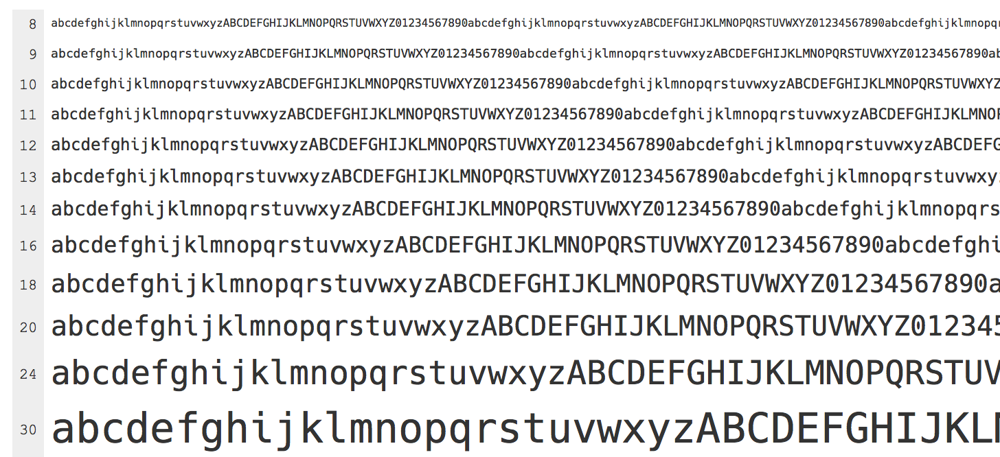

# Hack
### A typeface designed for source code

 

 

 

### About

Hack is an open source derivative of the fantastic Bitstream Vera Sans Mono typeface. It includes new glyphs and modifications of the original glyph set with the intent to make source code characters easily discernible at commonly used desktop (and laptop) display glyph sizes, and to make source code structure more legible.

### Data

- **Reserved Font Name**: Hack
- **Category**: Monospaced
- **Language Support**: Extended Latin, modern Greek, Cyrillic character sets
- **Powerline Support**: Yes
- **Glyph Number**: 1534
- **Included Styles**: Regular, Bold, Oblique, Bold Oblique

### Specimen

Click the image for the full type specimen.

### Changes

Font changes are in the [Changelog](https://github.com/chrissimpkins/Hack/blob/master/CHANGELOG.md).

### Build Binaries

#### Desktop Fonts

##### TrueType
- `build/ttf/Hack-Regular.ttf`
- `build/ttf/Hack-Bold.ttf`
- `build/ttf/Hack-Oblique.ttf`
- `build/ttf/Hack-BoldOblique.ttf`

##### OpenType
- `build/otf/Hack-Regular.otf`
- `build/otf/Hack-Bold.otf`
- `build/otf/Hack-Oblique.otf`
- `build/otf/Hack-BoldOblique.otf`

#### Web Fonts

##### EOT
- `build/eot/hack-regular-webfont.eot`
- `build/eot/hack-bold-webfont.eot`
- `build/eot/hack-regularoblique-webfont.eot`
- `build/eot/hack-boldoblique-webfont.eot`

##### SVG
- `build/svg/hack-regular-webfont.svg`
- `build/svg/hack-bold-webfont.svg`
- `build/svg/hack-regularoblique-webfont.svg`
- `build/svg/hack-boldoblique-webfont.svg`

##### WOFF
- `build/woff/hack-regular-webfont.woff`
- `build/woff/hack-bold-webfont.woff`
- `build/woff/hack-regularoblique-webfont.woff`
- `build/woff/hack-boldoblique-webfont.woff`

##### WOFF2
- `build/woff2/hack-regular-webfont.woff2`
- `build/woff2/hack-bold-webfont.woff2`
- `build/woff2/hack-regularoblique-webfont.woff2`
- `build/woff2/hack-boldoblique-webfont.woff2`

### License

Modified Version ("Hack") Copyright (c) 2015, Christopher Simpkins with Reserved Font Name Hack. 
MODIFIED SIL OPEN FONT LICENSE & BITSTREAM VERA LICENSE

Original Version ("Bitstream Vera Sans Mono") Copyright (c) 2003 Bitstream, Inc. with Reserved Font Names Bitstream and Vera 
BITSTREAM VERA LICENSE

The full text of these licenses is available in [LICENSE.md](https://github.com/chrissimpkins/Hack/blob/master/LICENSE.md)
