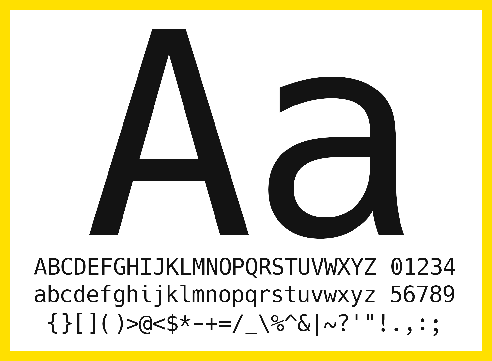

# Hack  

### a typeface designed for source code

<!-- TODO add links to bitstream vera and dejavu projects -->

No frills. No gimmicks. Hack is hand groomed and optically balanced to be a workhorse face for code. It has deep roots in the libre, open source typeface community and expands upon the contributions of the [Bitstream Vera]() &amp; [DejaVu]() projects.

[Read more](docs/ABOUT.md) about Hack, visit the [project website](http://sourcefoundry.org/hack/) or take a look at a complete [type specimen](http://chrissimpkins.github.io/Hack/font-specimen.html).

The font binaries are released under a license that permits unlimited print, desktop, and web use for commercial and non-commercial applications. More details in [LICENSE.md](LICENSE.md)

---

## Quick installation

<!-- TODO quick installation guide -->

### Advanced options (web font usage, package managers, etc.)

<!-- TODO intro about updates -->
<!-- TODO links to more details -->
<!-- TODO add a bit about font-line -->

A full list of all changes can be found in the [CHANGELOG](docs/CHANGELOG.md).

<!--
### New!

You can now modify the default line spacing in Hack fonts with our new `font-line` tool.  Hack uses a default value of 20% UPM for line spacing.  Decrease the value to tighten the spacing, increase it to widen your spacing.  Modification details are available on the `font-line` repository:

https://github.com/source-foundry/font-line

or [use one of our handy shell scripts](https://github.com/chrissimpkins/Hack/tree/master/tools/line-spacing) that automates the `font-line` install and line spacing modification process for a range of line spacing % UPM values between 10 - 30%.  Select the script that fits your needs and execute it in the download directory that contains your .ttf and/or .otf font files **before you install them**.
-->

---

### Overview

- **Typeface Name**: Hack
- **Category**: Monospaced
- **Powerline Support**: Yes
- **Number of glyphs**: 1561
- **Included glyph sets**: TODO
- **Included Styles**: Regular, Bold, Italic, Bold Italic
- **Latest release**: v2.020 (2016-04-29)

---

### License

**Hack** &copy; 2015-2016, Christopher Simpkins with Reserved Font Name Hack. 
Hack Open Font License &amp; Bitstream Vera License

**Bitstream Vera Sans Mono** &copy; 2003 Bitstream, Inc. with Reserved Font Names Bitstream and Vera 
Bitstream Vera License

See [LICENSE.md](https://github.com/chrissimpkins/Hack/blob/master/LICENSE.md) for the full texts of these licences.

[otf_latest]: https://github.com/chrissimpkins/Hack/releases/download/v2.020/Hack-v2_020-otf.zip
[ttf_latest]: https://github.com/chrissimpkins/Hack/releases/download/v2.020/Hack-v2_020-ttf.zip
