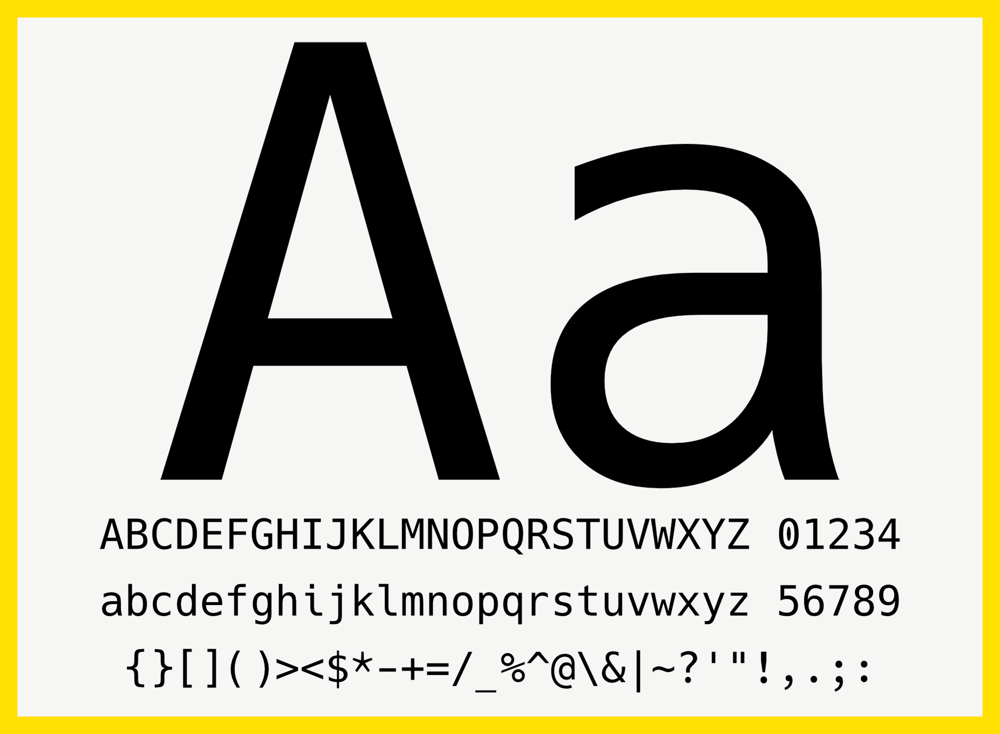
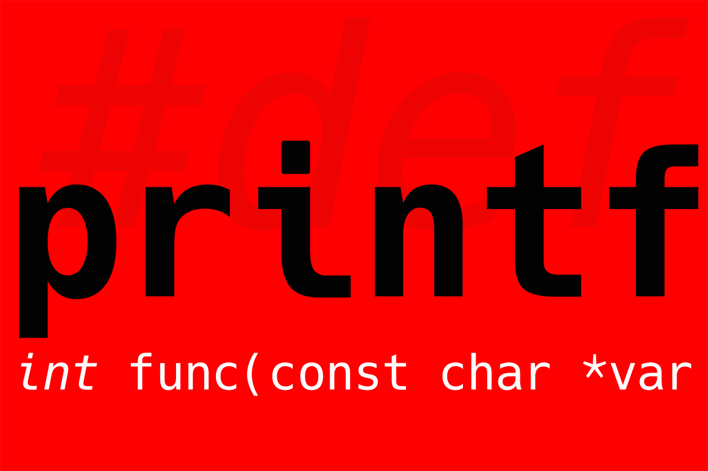
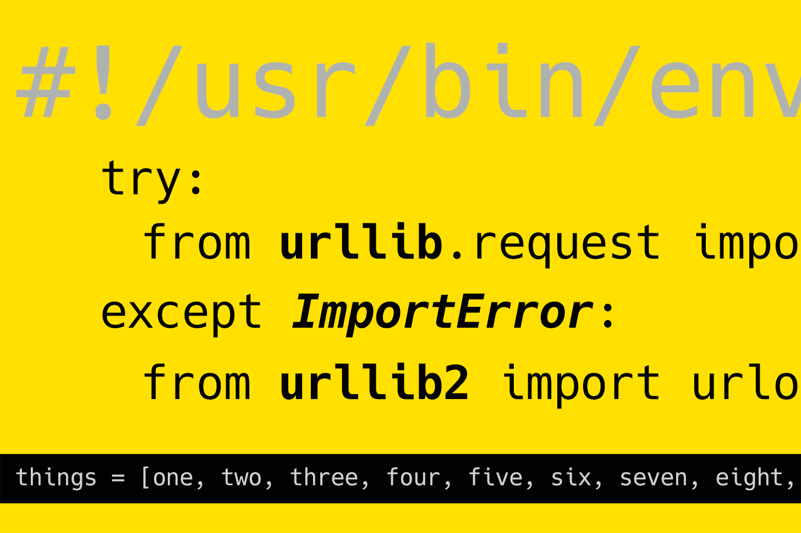
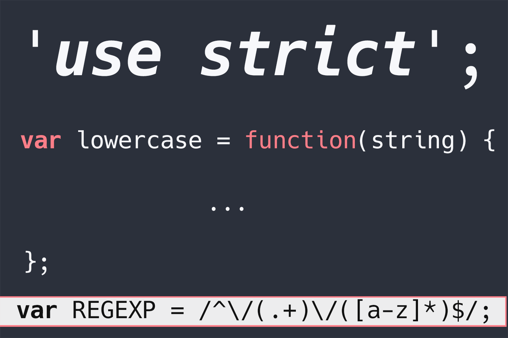
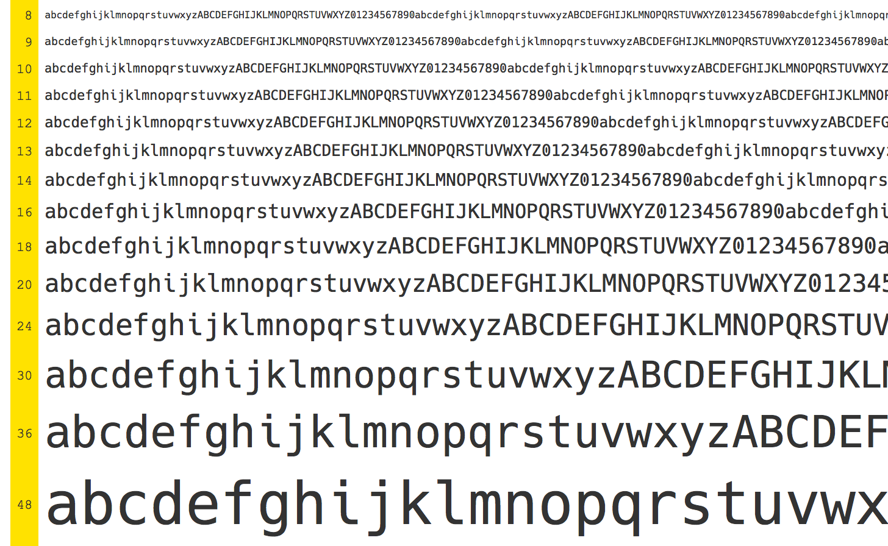

# Hack
### A typeface designed for source code

<a href="https://sourcefoundry.org/hack/"></a>
<br>
<a href="https://sourcefoundry.org/hack/"></a>
<br>
<a href="https://sourcefoundry.org/hack/"></a>
<br>
<a href="https://sourcefoundry.org/hack/"></a>

## Contents

- [About](https://github.com/chrissimpkins/Hack#about)
- [Typeface Data](https://github.com/chrissimpkins/Hack#data)
- [Type Specimen](http://chrissimpkins.github.io/Hack/font-specimen.html)
- [Desktop Usage](https://github.com/chrissimpkins/Hack#desktop-usage)
- [Web Font Usage](https://github.com/chrissimpkins/Hack#webfont-usage)
	- [Hack by CDN](https://github.com/chrissimpkins/Hack#hack-by-cdn)
	- [Self-Hosted Font Files](https://github.com/chrissimpkins/Hack#host-hack-font-files-on-your-server)
- [Build Binary List](https://github.com/chrissimpkins/Hack#build-binaries)
- [Changelog](https://github.com/chrissimpkins/Hack/blob/master/CHANGELOG.md)
- [Contributors](https://github.com/chrissimpkins/Hack/blob/master/CONTRIBUTORS.md)
- [License](https://github.com/chrissimpkins/Hack/blob/master/LICENSE.md)
- [FAQ](https://github.com/chrissimpkins/Hack/blob/master/FAQ.md)


### About

No frills. No gimmicks.  Hack is hand groomed and optically balanced to be a workhorse face for code.

It has deep roots in the libre, open source typeface community and expands upon the contributions of the Bitstream Vera &amp; DejaVu projects.  The face has been re-designed with a larger glyph set, modifications of the original glyph shapes (including distinct point styles and semi-bold punctuation weight in the regular set to make analphabetic characters less transparent), and meticulous attention to metrics (including numerous spacing adjustments to improve the rhythm of the face and the legibility of code at small text sizes).  The large x-height + wide aperture + low contrast design combined with Type 1 hinting/hint replacement programs and a TrueType instruction set make it highly legible at commonly used source code text sizes with a sweet spot that runs in the 8px - 12px range on modern desktop and laptop monitors.  Combine it with an HD monitor and you can comfortably work at 6 or 7px sizes.

The font binaries are released under a license that permits unlimited print, desktop, and web use for commercial and non-commercial applications.  It may be embedded and distributed in documents and applications.  The source is released in the widely supported UFO format and may be modified to derive new typeface branches.  The full text of the license is available in [LICENSE.md](https://github.com/chrissimpkins/Hack/blob/master/LICENSE.md)

### Data

- **Typeface Name**: Hack
- **Category**: Monospaced
- **Character Set Support**: Extended Latin, modern Greek, Cyrillic, Vietnamese, pan-African, Georgian, Armenian
- **Powerline Support**: Yes
- **Glyph Number**: 1534
- **Included Styles**: Regular, Bold, Oblique, Bold Oblique


### Specimen

<a href="http://chrissimpkins.github.io/Hack/font-specimen.html"></a>

Click the image for the full type specimen.


### Desktop Usage

#### Recommended Binaries for OS X Users

The .otf or .ttf files may be used on OS X platforms.

- [Download .otf fonts](https://github.com/chrissimpkins/Hack/releases/download/v2.010/Hack-v2_010-otf.zip)
- [Download .ttf fonts](https://github.com/chrissimpkins/Hack/releases/download/v2.010/Hack-v2_010-ttf.zip)

#### Recommended Binaries for Linux and Windows Users

The .ttf files are recommended for screen use on Linux and Windows platforms.

- [Download .ttf fonts](https://github.com/chrissimpkins/Hack/releases/download/v2.010/Hack-v2_010-ttf.zip)


### Webfont Usage

Hack webfonts are released in svg, eot, ttf, woff, and woff2 formats.  They include a complete Hack character set build and a smaller [basic Latin](http://www.unicode.org/charts/PDF/U0000.pdf) + [Latin-1 supplement](http://www.unicode.org/charts/PDF/U0080.pdf) Unicode character block build.  The latter build set is smaller in size and is intended to improve page loading times when you do not need the entire Hack character set.

You can view the rendering of the webfonts at a range of sizes on the [Hack type specimen](http://chrissimpkins.github.io/Hack/font-specimen.html).

#### Hack by CDN

Thanks to the generous gang at [jsDelivr](https://github.com/jsdelivr/jsdelivr), you can use a CDN to include Hack on your site with a single stylesheet link in the head of your HTML files.  There is no need to download font files from the repository or serve them from your web server.

Average latency, average uptime, and total downtime data for jsDelivr vs. other popular CDN are available for [http](http://www.cdnperf.com/#jsdelivr,cdnjs,google,yandex,microsoft,jquery,bootstrapcdn/http/30) and [https](http://www.cdnperf.com/#jsdelivr,cdnjs,google,yandex,microsoft,jquery,bootstrapcdn/https/30) protocols.  Please understand that this is a free CDN resource and, while it does have industry backing, it could go away at anytime.  If this is a critical issue for your use scenario, please purchase your own CDN plan and host the webfonts yourself.

Include **one** of the following lines in the `<head>` section of your site's HTML:

##### Basic Latin + Latin-1 Supplement Character Set

```html
<link rel="stylesheet" href="//cdn.jsdelivr.net/font-hack/2.010/css/hack.min.css">
```

##### Full Character Set

```html
<link rel="stylesheet" href="//cdn.jsdelivr.net/font-hack/2.010/css/hack-extended.min.css">
```

Then style your text by including `Hack` in the appropriate `font-family` property of your CSS.  For example:

```css
code {
	font-family: Hack, monospace;
}
```

The **bold**, *oblique*, and <b><i>bold oblique</i></b> text styles are formatted with HTML using `<b>text block</b>`, `<i>text block</i>`, and `<b><i>text block</i></b>` HTML tags, respectively.


#### Host Hack Font Files on Your Server

Download the entire web font archive at this link:

- [Download Web Font Archive (all)](https://github.com/chrissimpkins/Hack/releases/download/v2.010/Hack-v2_010-webfonts.zip)

Or select the fonts that you need in subdirectories of the build directory:

- [Download .svg fonts](https://github.com/chrissimpkins/Hack/tree/master/build/svg)
- [Download .eot fonts](https://github.com/chrissimpkins/Hack/tree/master/build/eot)
- [Download .ttf fonts](https://github.com/chrissimpkins/Hack/tree/master/build/web-ttf) - **Note**: these differ from the desktop versions and are intended for web use
- [Download .woff fonts](https://github.com/chrissimpkins/Hack/tree/master/build/woff)
- [Download .woff2 fonts](https://github.com/chrissimpkins/Hack/tree/master/build/woff2)

The web font archive download is structured like this:

```
.
├── css
│   ├── hack-extended.css
│   ├── hack-extended.min.css
│   ├── hack.css
│   └── hack.min.css
└── fonts
    ├── eot
    │   ├── hack-bold-webfont.eot
    │   ├── hack-boldoblique-webfont.eot
    │   ├── hack-regular-webfont.eot
    │   ├── hack-regularoblique-webfont.eot
    │   └── latin
    │       ├── hack-bold-latin-webfont.eot
    │       ├── hack-boldoblique-latin-webfont.eot
    │       ├── hack-regular-latin-webfont.eot
    │       └── hack-regularoblique-latin-webfont.eot
    ├── svg
    │   ├── hack-bold-webfont.svg
    │   ├── hack-boldoblique-webfont.svg
    │   ├── hack-regular-webfont.svg
    │   ├── hack-regularoblique-webfont.svg
    │   └── latin
    │       ├── hack-bold-latin-webfont.svg
    │       ├── hack-boldoblique-latin-webfont.svg
    │       ├── hack-regular-latin-webfont.svg
    │       └── hack-regularoblique-latin-webfont.svg
    ├── ttf
    │   ├── hack-bold-webfont.ttf
    │   ├── hack-boldoblique-webfont.ttf
    │   ├── hack-regular-webfont.ttf
    │   ├── hack-regularoblique-webfont.ttf
    │   └── latin
    │       ├── hack-bold-latin-webfont.ttf
    │       ├── hack-boldoblique-latin-webfont.ttf
    │       ├── hack-regular-latin-webfont.ttf
    │       └── hack-regularoblique-latin-webfont.ttf
    ├── woff
    │   ├── hack-bold-webfont.woff
    │   ├── hack-boldoblique-webfont.woff
    │   ├── hack-regular-webfont.woff
    │   ├── hack-regularoblique-webfont.woff
    │   └── latin
    │       ├── hack-bold-latin-webfont.woff
    │       ├── hack-boldoblique-latin-webfont.woff
    │       ├── hack-regular-latin-webfont.woff
    │       └── hack-regularoblique-latin-webfont.woff
    └── woff2
        ├── hack-bold-webfont.woff2
        ├── hack-boldoblique-webfont.woff2
        ├── hack-regular-webfont.woff2
        ├── hack-regularoblique-webfont.woff2
        └── latin
            ├── hack-bold-latin-webfont.woff2
            ├── hack-boldoblique-latin-webfont.woff2
            ├── hack-regular-latin-webfont.woff2
            └── hack-regularoblique-latin-webfont.woff2
```

Push the `css` and `fonts` directories to your web server, then import **one** of the included CSS files in the `head` section of the HTML where you would like to use it.

Replace `path/to/` with the actual path to your css directory.

##### Basic Latin + Latin-1 Supplement Character Set

```html
<link rel="stylesheet" href="path/to/css/hack.min.css">
```


##### Full Character Set

```html
<link rel="stylesheet" href="path/to/css/hack-extended.min.css">
```

You can alter the path to the Hack files (e.g. place the files in a `hack` resource subdirectory); however, please make sure that you preserve the relative file paths included in the release archive (*or be prepared to modify the paths to the font files*).

Then style your text by including `Hack` in the appropriate `font-family` property of your CSS.  For example:

```css
code {
	font-family: Hack, monospace;
}
```

The **bold**, *oblique*, and <b><i>bold oblique</i></b> text styles are formatted with HTML using `<b>text block</b>`, `<i>text block</i>`, and `<b><i>text block</i></b>` HTML tags, respectively.


##### Webfont Caching and gzip Compression with Cloudflare

*The following information applies to both paid and free accounts*

If you use [Cloudflare](https://cloudflare.com), woff files are cached by default.  To cache the remaining webfont files, add a new page rule for the path to your fonts directory:

```
yoursite.com/path/to/fonts/
```

 and set the rule to `Cache Everything`.

 Cloudflare automates gzip compression of ttf, eot, woff, and svg font files.  The service does not gzip compress woff2 files.


### Build Binaries

#### Desktop Fonts

##### TTF Builds
- `build/ttf/Hack-Regular.ttf`
- `build/ttf/Hack-Bold.ttf`
- `build/ttf/Hack-Oblique.ttf`
- `build/ttf/Hack-BoldOblique.ttf`

##### OTF Builds
- `build/otf/Hack-Regular.otf`
- `build/otf/Hack-Bold.otf`
- `build/otf/Hack-Oblique.otf`
- `build/otf/Hack-BoldOblique.otf`

#### Web Fonts

##### EOT
- `build/eot/hack-regular-webfont.eot`
- `build/eot/hack-bold-webfont.eot`
- `build/eot/hack-regularoblique-webfont.eot`
- `build/eot/hack-boldoblique-webfont.eot`
- `build/eot/latin/hack-regular-latin-webfont.eot`
- `build/eot/latin/hack-bold-latin-webfont.eot`
- `build/eot/latin/hack-regularoblique-latin-webfont.eot`
- `build/eot/latin/hack-boldoblique-latin-webfont.eot`

##### SVG
- `build/svg/hack-regular-webfont.svg`
- `build/svg/hack-bold-webfont.svg`
- `build/svg/hack-regularoblique-webfont.svg`
- `build/svg/hack-boldoblique-webfont.svg`
- `build/svg/latin/hack-regular-latin-webfont.svg`
- `build/svg/latin/hack-bold-latin-webfont.svg`
- `build/svg/latin/hack-regularoblique-latin-webfont.svg`
- `build/svg/latin/hack-boldoblique-latin-webfont.svg`

##### Web TTF
- `build/web-ttf/hack-regular-webfont.ttf`
- `build/web-ttf/hack-bold-webfont.ttf`
- `build/web-ttf/hack-regularoblique-webfont.ttf`
- `build/web-ttf/hack-boldoblique-webfont.ttf`
- `build/web-ttf/latin/hack-regular-latin-webfont.ttf`
- `build/web-ttf/latin/hack-bold-latin-webfont.ttf`
- `build/web-ttf/latin/hack-regularoblique-latin-webfont.ttf`
- `build/web-ttf/latin/hack-boldoblique-latin-webfont.ttf`

##### WOFF
- `build/woff/hack-regular-webfont.woff`
- `build/woff/hack-bold-webfont.woff`
- `build/woff/hack-regularoblique-webfont.woff`
- `build/woff/hack-boldoblique-webfont.woff`
- `build/woff/latin/hack-regular-latin-webfont.woff`
- `build/woff/latin/hack-bold-latin-webfont.woff`
- `build/woff/latin/hack-regularoblique-latin-webfont.woff`
- `build/woff/latin/hack-boldoblique-latin-webfont.woff`

##### WOFF2
- `build/woff2/hack-regular-webfont.woff2`
- `build/woff2/hack-bold-webfont.woff2`
- `build/woff2/hack-regularoblique-webfont.woff2`
- `build/woff2/hack-boldoblique-webfont.woff2`
- `build/woff2/latin/hack-regular-latin-webfont.woff2`
- `build/woff2/latin/hack-bold-latin-webfont.woff2`
- `build/woff2/latin/hack-regularoblique-latin-webfont.woff2`
- `build/woff2/latin/hack-boldoblique-latin-webfont.woff2`


### Changes

Changes are in the [Changelog](https://github.com/chrissimpkins/Hack/blob/master/CHANGELOG.md).


### License

Modified Version ("Hack") Copyright (c) 2015, Christopher Simpkins with Reserved Font Name Hack.<br>
MODIFIED SIL OPEN FONT LICENSE & BITSTREAM VERA LICENSE

Original Version ("Bitstream Vera Sans Mono") Copyright (c) 2003 Bitstream, Inc. with Reserved Font Names Bitstream and Vera<br>
BITSTREAM VERA LICENSE

The full text of these licenses is available in [LICENSE.md](https://github.com/chrissimpkins/Hack/blob/master/LICENSE.md)
