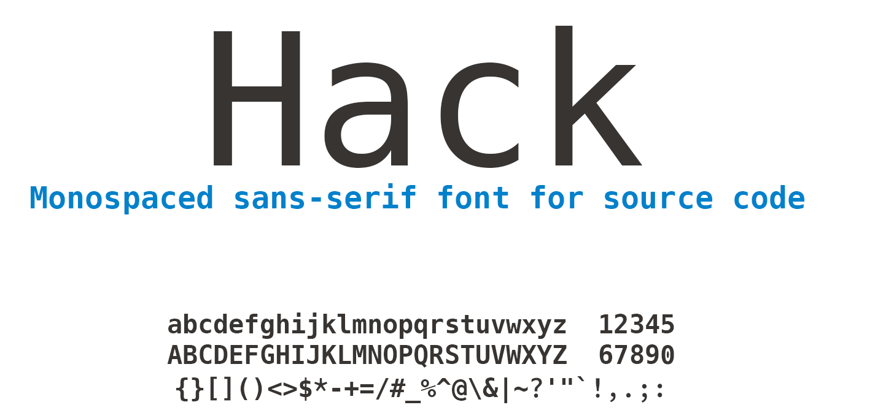

## Hack: a monospaced sans-serif font for source code

### About

Hack is a derivative of the fantastic Bitstream Vera Sans Mono typeface. It includes new glyphs and modifications of the original glyph set with the goal to make source code text more clear and legible across programming languages at commonly used desktop (and laptop) display glyph sizes.

The primary changes in the current iteration of the font include a new punctuation glyph style and modifications in the metrics of punctuation glyphs.  There is also a sexy new zero glyph style for those who appreciate such subtleties...

### Data

- **Reserved Font Name**: Hack
- **Category**: Monospaced
- **Full Language Support**: Basic Latin, Euro, Turkish, Western European
- **Glyph Number**: 269
- **Included Variants**: Regular, Bold, Regular Oblique, Bold Oblique
- **Included Web Font Types**: `.eot`, `.woff`, `.woff2`

### Changes

Font changes are in the [Changelog](https://github.com/chrissimpkins/Hack/blob/master/CHANGELOG.md).

### License

Modified Version ("Hack") Copyright (c) 2015, Christopher Simpkins with Reserved Font Name Hack. 
MODIFIED SIL OPEN FONT LICENSE & BITSTREAM VERA LICENSE

Original Version ("Bitstream Vera Sans Mono") Copyright (c) 2003 Bitstream, Inc. with Reserved Font Names Bitstream and Vera 
BITSTREAM VERA LICENSE

The full text of these licenses is available in [LICENSE.md]((https://github.com/chrissimpkins/Hack/blob/master/LICENSE.md))
